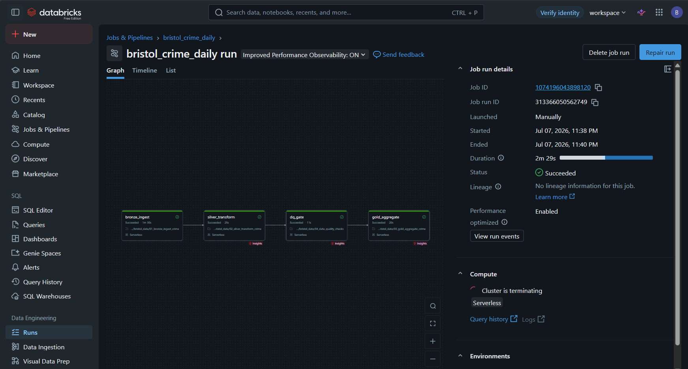
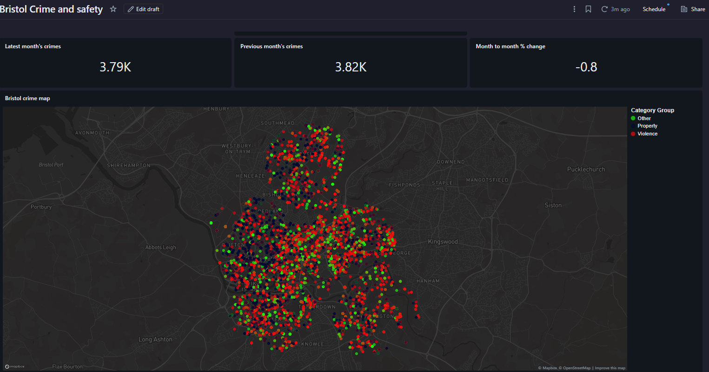

# Bristol Crime & Safety Analytics Pipeline


An end to end data engineering project ingesting street level crime data for Bristol from the official UK Police open data API, transforming it through a medallion architecture (Bronze, Silver, Gold) with a data quality gate, and serving a published interactive dashboard. Built and running on Databricks (Free Edition, serverless); designed to be platform portable, with the same notebooks verified against the Azure Fabric API surface — the stack used by Bristol City Council's Data and Insight Team.

<!-- Once recorded, uncomment and add your Loom link:
▶ **[Watch the 2 minute pipeline walkthrough](YOUR_LOOM_LINK)**
-->

---

## Architecture

```
UK Police API (data.police.uk)
        │  REST, no auth, monthly street level crime JSON
        ▼
┌─────────────────────────────────────────────────┐
│  01_bronze_ingest_crime                         │
│  Raw JSON landed exactly as received            │
│  Partitioned by ingestion month, immutable      │
└─────────────────────────────────────────────────┘
        ▼
┌─────────────────────────────────────────────────┐
│  02_silver_transform_crime                      │
│  Flatten nested JSON, cast types, dedupe,       │
│  standardise categories → Delta table           │
└─────────────────────────────────────────────────┘
        ▼
┌─────────────────────────────────────────────────┐
│  04_data_quality_checks (gate)                  │
│  Volume, nullness, validity, freshness checks   │
│  Pipeline fails loudly if quality drops         │
└─────────────────────────────────────────────────┘
        ▼
┌─────────────────────────────────────────────────┐
│  03_gold_aggregate_crime                        │
│  Star schema: fact_crime + dim_date +           │
│  dim_category + monthly area aggregates         │
└─────────────────────────────────────────────────┘
        ▼
   AI/BI Dashboard (Databricks) · Power BI portable
```

## Live pipeline



Runs daily at 06:00 UK time on Databricks serverless as a four task job (bronze → silver → quality gate → gold). The data quality gate between Silver and Gold enforces volume, nullness, validity, and freshness thresholds; any failed check raises an exception, which fails the run and triggers an email alert before bad data can reach the dashboard. Ingestion is idempotent, so re-runs against unchanged source data are harmless by design.



## Data source

The UK Police API publishes anonymised street level crime for all forces in England and Wales, updated monthly. Bristol is covered by the Avon and Somerset force. Bristol City Council's own open data portal sources its street crime dataset from this same API, so this project works with the council's upstream source.

- Docs: https://data.police.uk/docs/
- Endpoint used: `GET https://data.police.uk/api/crimes-street/all-crime?lat={lat}&lng={lng}&date=YYYY-MM`
- No API key required. Open Government Licence.
- Note: locations are anonymised snap points, not exact addresses (privacy by design). This informed the dashboard choice of a point map over a density heatmap, which would amplify anonymisation artefacts.

## Project layout

```
Bristol_crimes_pipeline/
├── README.md
├── DATABRICKS.md                 Full Databricks Free Edition walkthrough
├── requirements.txt
├── config/
│   └── pipeline_config.json      All tunable parameters in one place
├── notebooks/
│   ├── 01_bronze_ingest_crime.py
│   ├── 02_silver_transform_crime.py
│   ├── 03_gold_aggregate_crime.py
│   └── 04_data_quality_checks.py
├── sql/
│   └── gold_views.sql            Analyst-friendly views over the gold layer
├── pipeline/
│   └── fabric_pipeline_guide.md  Orchestration guide (Fabric variant)
├── powerbi/
│   └── dashboard_setup.md        Dashboard build guide (AI/BI + Power BI)
└── screenshots/
```

## Quick start (Databricks — as built)

1. Sign up for Databricks Free Edition (free, any email, no card needed).
2. Create a Volume: Catalog → workspace → default → Create → Volume → name it `bristol`. Upload `config/pipeline_config.json` into a `config/` folder inside it.
3. Import the four notebooks from `notebooks/` into your workspace.
4. Run in order: 01 → 02 → 04 → 03. The platform shim at the top of each notebook detects Databricks automatically and resolves all paths from the config.
5. Schedule via Jobs & Pipelines: four chained tasks (bronze → silver → dq gate → gold), daily trigger, email notification on failure.
6. Build the dashboard following `powerbi/dashboard_setup.md`.

Full walkthrough with screenshots of each step: [DATABRICKS.md](DATABRICKS.md)

## Quick start (Azure Fabric — portable alternative)

The same notebooks run unmodified on Fabric; the platform shim detects `mssparkutils` and switches paths.

1. Sign up for the free Microsoft Fabric trial at app.fabric.microsoft.com.
2. Create a workspace and a Lakehouse named `bristol_lakehouse`.
3. Upload `pipeline_config.json` to `Files/config/` in the Lakehouse.
4. Create four notebooks from `notebooks/`, attach each to the Lakehouse.
5. Run 01, then 02, then 04, then 03. Confirm Delta tables appear under Tables.
6. Follow `pipeline/fabric_pipeline_guide.md` to chain them into a scheduled Data Pipeline, and `powerbi/dashboard_setup.md` for the Power BI (DirectLake) report.

## Why medallion architecture

- **Bronze** is the insurance policy. If transform logic has a bug, replay from raw without hitting the API again.
- **Silver** is a single cleaned version of the truth that any downstream consumer can trust.
- **Gold** is shaped for the questions the business asks, so the BI layer stays fast and simple.

This is the pattern both Databricks and Fabric are designed around.

## Engineering decisions worth noting

- **Idempotent everywhere**: partition overwrite in Bronze, Delta MERGE in Silver. Running the pipeline five times produces the same state as running it once.
- **Deterministic dedup**: overlapping API query circles mean duplicate records by design; deduplication uses a window function rather than dropDuplicates so the surviving row is reproducible.
- **Quality gate placement**: checks run after Silver and before Gold, so a failure preserves the last known good dashboard state instead of publishing bad numbers.
- **Config driven**: no hardcoded values in notebooks; retargeting the pipeline (different city, different thresholds) is a config change, not a code change.

## Known limitations and next steps

- The `area` column derives from ingestion query points, an approximation. Next step: spatial join of coordinates to Bristol's official ward boundary GeoJSON for true ward level analysis.
- Recent months under report outcomes because investigations take time; outcome analysis should exclude or caveat the latest 3 months.
- Crime locations are anonymised snap points; analysis is valid at area level, not address level.
